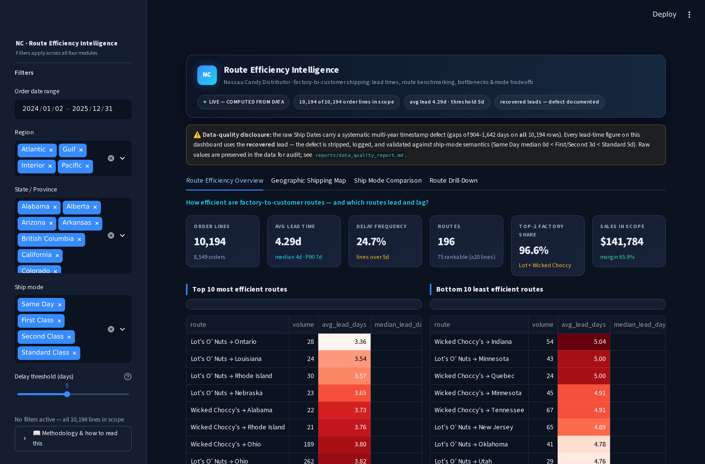
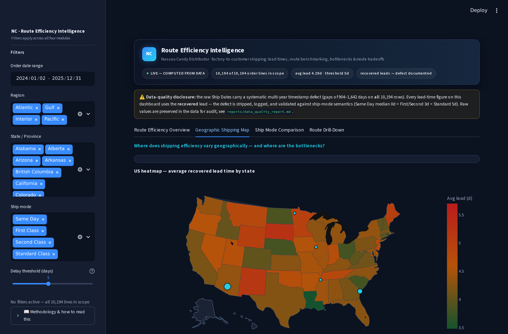
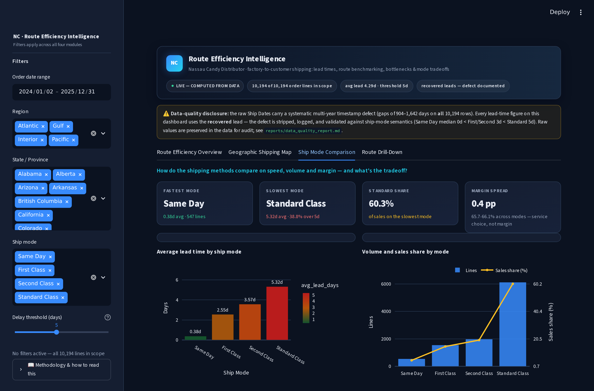
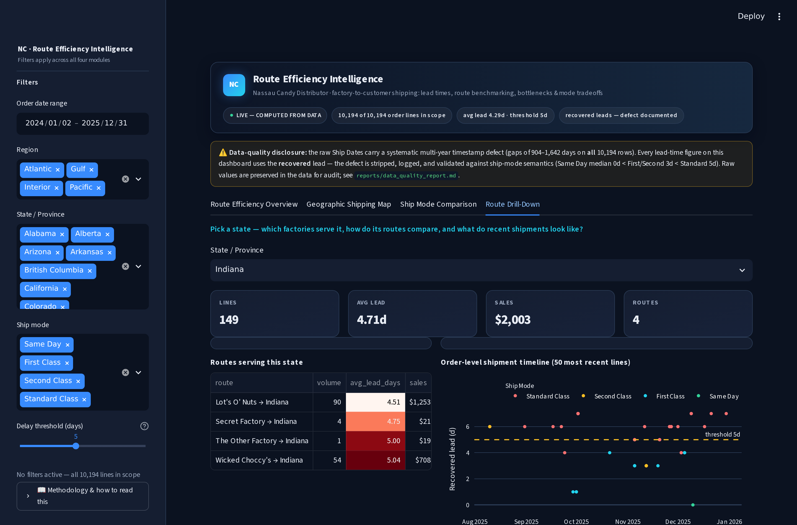

# Factory-to-Customer Shipping Route Efficiency Analysis — Nassau Candy Distributor

[](https://github.com/rishi-1603/Factory-to-Customer-Shipping-Route-Efficiency-Analysis-for-Nassau-Candy-Distributor/actions/workflows/ci.yml)
[](https://www.python.org/)
[](#testing--ci)

End-to-end route-efficiency intelligence over **10,194 order lines** (5 factories · 59 US-state & Canadian-province codes · 196 routes · 4 ship modes): a data-quality-first cleaning pipeline, the spec's five KPIs, a 4-module Streamlit dashboard, a SQL layer mirroring every Python calculation, and **23 automated tests that pin every headline number** — including the structure of the timestamp defect this project is built around.

---

## ⚠️ The headline data-quality catch

**Every ship date in the raw data sits 904–1,642 days after its order date** — a 2.5–4.5-year "lead time" for candy, on 100% of rows. The gap decomposes **exactly** into `904 + 365×K + true lead` (K ∈ {0,1,2}) — three bands precisely 365 days apart: a systematic multi-year generation offset, not shipping behaviour.

**Recovery:** `recovered lead = (gap − 904) mod 365` → true 0–11 day leads.
**Validation gate:** recovered leads respect ship-mode semantics exactly — Same Day median 0d < First/Second 3d < Standard 5d, non-overlapping supports. The pipeline *refuses to publish* if that ordering ever breaks, and the raw values stay in the data for audit.

## Headline results (all test-pinned)

| Metric | Value |
|---|---|
| Average recovered lead time | **4.29 days** (median 4, P90 7, range 0–11) |
| Delay frequency (5-day threshold) | **24.7%** of lines |
| Routes benchmarked | **196** (75 with ≥20 lines efficiency-scored) |
| Fastest route | Lot's O' Nuts → Ontario — **3.36d** (score 100) |
| Slowest route | Wicked Choccy's → Indiana — **5.04d**, 46.3% delay freq (score 0) |
| Sales on the network | **$141,783.63** at 65.9% margin |

### Three findings that drive the recommendations

1. **Delay is mode-driven, not geography-driven.** Route averages span 3.4–5.0 days; ship modes span 0.4–5.3 days (~2.4× the route spread). Standard Class carries **60.3% of sales** at the slowest average (5.32d) and **38.8% delay frequency**, while Same Day / First Class run at 0%.
2. **Mode choice is a service decision, not a margin lever.** Margins are uniform across all four modes (65.7–66.1%).
3. **Concentration risk: 96.6% of volume on 2 of 5 factories** (Lot's O' Nuts 55.8% + Wicked Choccy's 40.7%). Plus 17 volume-weighted bottleneck states (worst: Minnesota, 4.96d).

## Dashboard — 4 modules (Streamlit + Plotly, per the spec)









**User capabilities (per the spec):** order-date range · region · state/province · ship-mode filters · adjustable delay-threshold slider — everything recomputes live.

## Quickstart (local)

```bash
git clone https://github.com/rishi-1603/Factory-to-Customer-Shipping-Route-Efficiency-Analysis-for-Nassau-Candy-Distributor.git
cd Factory-to-Customer-Shipping-Route-Efficiency-Analysis-for-Nassau-Candy-Distributor
pip install -r requirements.txt

python scripts/01_clean_data.py        # raw -> processed + data-quality report
python scripts/02_analysis_report.py   # deterministic analysis report
python -m pytest tests/ -v             # 23 tests
streamlit run dashboard/app.py         # the dashboard
```

The 2 MB raw dataset ships in git — no extra downloads.

## Repository structure

```
├── dashboard/app.py      # 4-module Streamlit dashboard
├── scripts/              # 01_clean_data.py · 02_analysis_report.py (deterministic)
├── src/                  # config (defect model, factory map) · data_cleaning · kpis · analytics
├── sql/                  # schema.sql · kpis.sql · analysis.sql (mirror the Python)
├── tests/                # 23 tests — defect structure, recovery, every KPI
├── docs/                 # methodology, dictionaries, exec summary, research paper, …
├── reports/              # generated reports (CI-verified byte-identical)
└── data/                 # raw (in git, 2 MB) + processed (generated)
```

## Documentation

| Doc | Contents |
|---|---|
| [docs/methodology.md](docs/methodology.md) | The timestamp defect: detection → diagnosis → recovery → validation gate; grain & KPI rules |
| [docs/executive_summary.md](docs/executive_summary.md) | One-page management summary + prioritized actions |
| [docs/data_dictionary.md](docs/data_dictionary.md) | All 18 raw + 6 derived columns, factory coordinates, product-factory map |
| [docs/kpi_dictionary.md](docs/kpi_dictionary.md) | The five KPIs — formulas, defaults, pinned values |
| [docs/research_paper.md](docs/research_paper.md) | Full write-up (abstract → conclusion) |
| [docs/interview_prep.md](docs/interview_prep.md) | 60-second walkthrough + the hard questions |
| [reports/data_quality_report.md](reports/data_quality_report.md) | Transformation log + the defect |
| [reports/analysis_report.md](reports/analysis_report.md) | Generated analysis report (deterministic) |

## Testing & CI

**23 tests** cover: the defect's presence and band structure, the exact recovered-lead
distribution, the ship-mode validation gate (including a sabotage test proving the pipeline fails
loudly on bad recovery), route/KPI pins (196 routes, best/worst, mode stats, bottlenecks,
concentration), and an AppTest that renders the dashboard end-to-end.

CI installs dependencies, runs the full pipeline, **fails if the reports regenerate
non-identically**, runs all tests, and smoke-tests the dashboard.

## Data & disclosure

Synthetic dataset supplied with the official project specification (Unified Mentor / Nassau
Candy). Grain: order line. US + Canada in scope (200 Canadian lines, kept and filterable; the
spec's heatmap covers US states). No carrier-cost field → cost-time tradeoffs are descriptive.

---

**Author:** Dappu Rishi Raghukumar · [LinkedIn](https://www.linkedin.com/in/rishidappu1603) · [GitHub](https://github.com/rishi-1603) · MIT License
